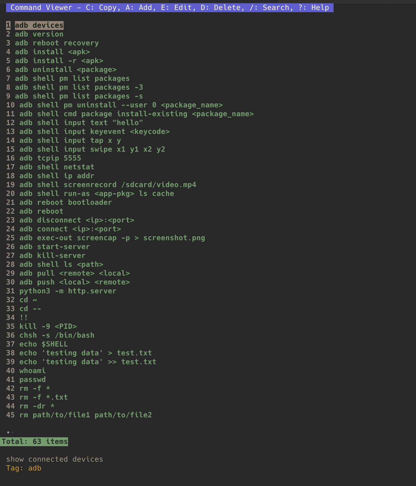
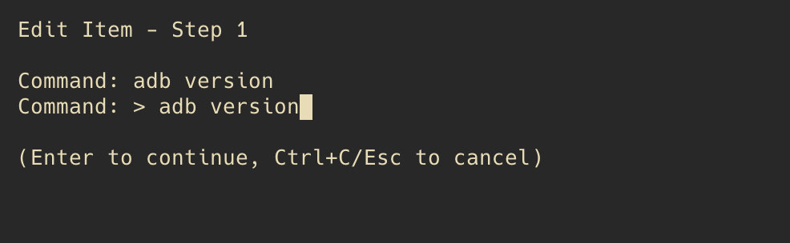

# Command Viewer

A terminal-based UI application for managing and viewing command snippets. Built with Go and Bubble Tea.

## Features

- View and organize command snippets with descriptions and tags
- Search/filter commands quickly
- Copy commands to clipboard
- Add, edit, and delete commands
- Clean TUI interface with keyboard navigation

## Installation

```bash
go build -o cmdviewer
```

## Usage

```bash
./cmdviewer
```

### Help

```bash
./cmdviewer --help
```

## Keybindings

| Key | Action |
|-----|--------|
| `c` | Copy command to clipboard |
| `a` | Add new command |
| `e` | Edit command |
| `d` | Delete command |
| `/` | Search commands |
| `?` | Show help |
| `q` | Quit |

## Data Storage

Commands are stored in `home/.cmdviewer/data.json` in the application directory.

**JSON Structure:**
```json
[
  {
    "cmd": "adb devices",
    "desc": "show connected devices",
    "tag": "adb"
  }
]
```

## Requirements

- Go 1.19+
- Terminal with true color support (recommended)


## Screenshots

<div>
  
  
</div>